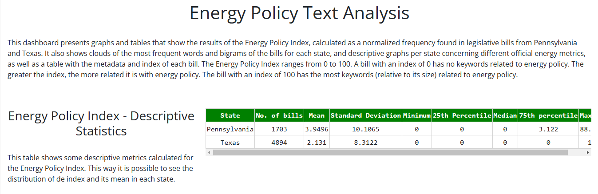
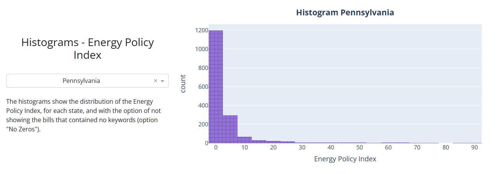
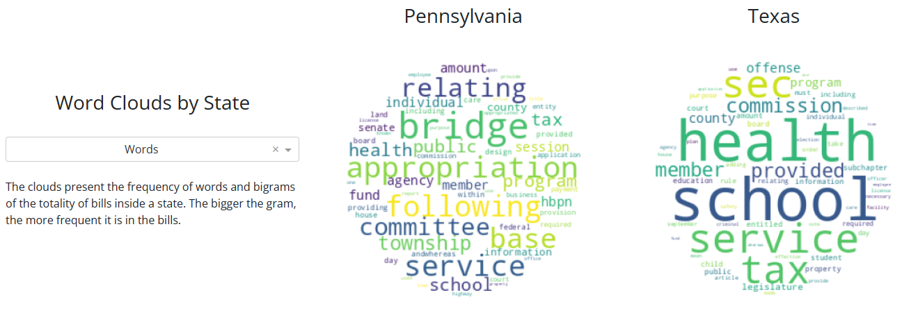
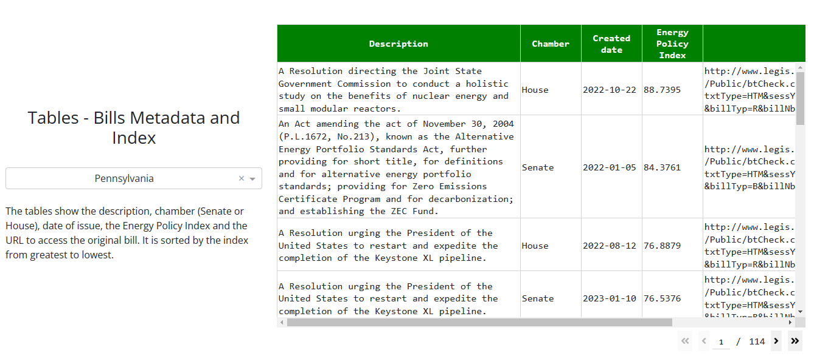

# The Cody Bills: 
## Analyzing The Energy Policy of US states largest energy producers

Is the legislation of a state highly related to the main economic activities of that state? We do not intend to entirely answer this question but in this project, we explore a framework to analyze the frequency in which a specific topic or policy field was discussed in the bills proposed in any state in the U.S. As a case study, we chose energy policy and the states of Texas and Pennsylvania. These two states were the two main energy producer states in 2020 with 23,329 trillion btu and 9,492 trillion btu per the *U.S. Energy Information Administration (EIA)*. To collect the bills, we relied on the *OpenStates* website (https://openstates.org/) which allowed us to scrap all the state bills proposed by Texas’ and Pennsylvania’s congressional representatives since 2022. We use a simple sliding window algorithm to measure the presence of a list of energy-policy-related key words or ngrams we created following the EIA glossary (https://www.eia.gov/tools/glossary/). More specifically, we calculate a Normalized Energy Policy Index for each bill depending on the number of times each key word or ngram appear in its text. This information is displayed in a dashboard alongside relevant Energy production/consumption indicators (e.g. Energy expenditure per capita or energy consumption percapita) we collected from  EIA (https://www.eia.gov/state/rankings) to have a more complete context. 

## Getting Started 

**NOTE**: All codes to be run from within the project root directory

1) Clone this repo into your server ``git clone https://github.com/uchicago-capp122-spring23/30122-project-the-cody-bills.git``

2)  Set up the virtual environment to install all the packages or dependencies used in the project by running command ``poetry install``, and activate the virtual environment running ``poetry shell``

3)  To run the main dashboard of the project run ``python -m cody_bills``. Follow the generated URL link (eg: http://127.0.0.1:38456/) by ctrl + clicking on it (on Windows)or command + click (on Mac).

4)  If you want to recreate the intermediate steps

    a) To collect the Bills we used for Pennsylvania and Texas, run ``line of code``

    b) To clean the bills and conduct the text analysis (word-clouds and Energy Policy index calculation), run ``python -m cody_bills.Text_Preprocessing.text_analysis``

    c) To clean up the energy indicators data and save it, run ``poetry run python cody_bills/energy_states/eia_clean.py``. To generate the graphs comparing the states across several Energy policy indicators and saves them into figures, run ``poetry run python cody_bills/energy_states/energy_dataviz.py``

## Interacting with the Dashboard

The dashboard has 5 main panels the user can interact with:

1) **Energy Policy Index - Descriptive Statistics:** This table shows some descriptive metrics calculated for the Energy Policy Index. This way it is possible to see the distribution of de index and its mean in each state.

    

2) **Histograms - Energy Policy Index:** The histograms show the distribution of the Energy Policy Index, for each state, and with the option of not showing the bills that contained no keywords (option "No Zeros"). The user can choose or filter between 4 options: "Pennsylvania" or "Texas" to see the distribution of all the bills for each of these states, but also can choose "Pennsylvania - No Zeros" and "Texas - No Zeros" to see the distributions excluding the bills for which we didn't find any key ngram related to the Energy Policy. Hovering over any bar of the histogram will show the interval of the normalized Energy Policy index and the number of bills withint that interval (frequency).

    

3) **Word Clouds by State:** The clouds present the frequency of words and bigrams of the totality of bills inside a state. The larger the size of the ngram within the cloud, the more frequent it is in the bills. The user can choose between unigrams or bigrams from the dropdown and The word(bigram) - clouds of each state will be displayed side by side for comparisons.

    

4) **Energy and CO2 Emission Barcharts:** These panel presents 4 variables (Percentage of U.S. Total Energy production, Percentage of U.S. total Carbon Dioxide Emissions, Energy Expenditure per capita and Energy Consumed per capita) related to energy policy the user can select from the above dropdown. Once the variable is selected a bar chart for each state will be displayed showing not only the level for the given variable but also the ranking of the state, compared to all of US states.

    

5) **Tables - Bills Metadata and Index:** The tables show the description, chamber (Senate or House), date of issue, the Energy Policy Index and the URL to access the original bill. It is sorted by the index from greatest to lowest.

    

